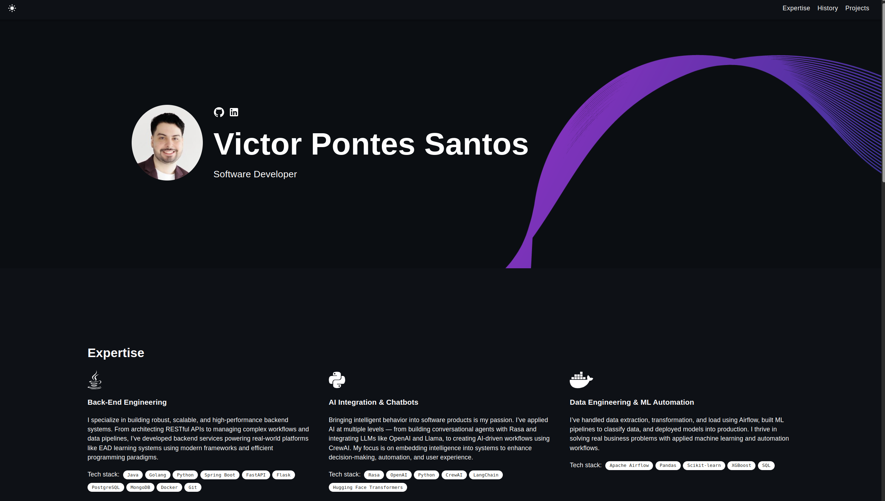

# 🌟 My Developer Portfolio

      

## ✨ About This Portfolio

This is my personal developer portfolio built using modern web technologies. It showcases my projects, skills, background, and career highlights. The layout is fully responsive, customizable, and features both light and dark modes.

Feel free to [view the live version](https://github.com/supervipe/Portfolio/).



## 🚀 Features

- ✅ Mobile-friendly & responsive  
- ✅ Dark/light mode toggle  
- ✅ Modular React components  
- ✅ Built with TypeScript, JavaScript, SCSS  
- ✅ Easy to deploy with GitHub Pages or other platforms  

## ⚙️ Getting Started

1. **Install Node.js** if you haven’t already:

    ```bash
    node -v
    ```

2. **Install dependencies**:

    ```bash
    npm install
    ```

3. **Run locally**:

    ```bash
    npm start
    ```

---

## 📄 License & Attribution

This project is based on [react-portfolio-template](https://github.com/yujisatojr/react-portfolio-template) by Yuji Sato and is licensed under the MIT License.  
Modifications and customizations were made by Victor Pontes Santos.
